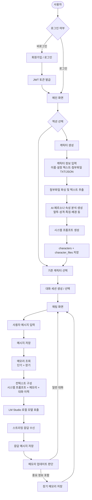
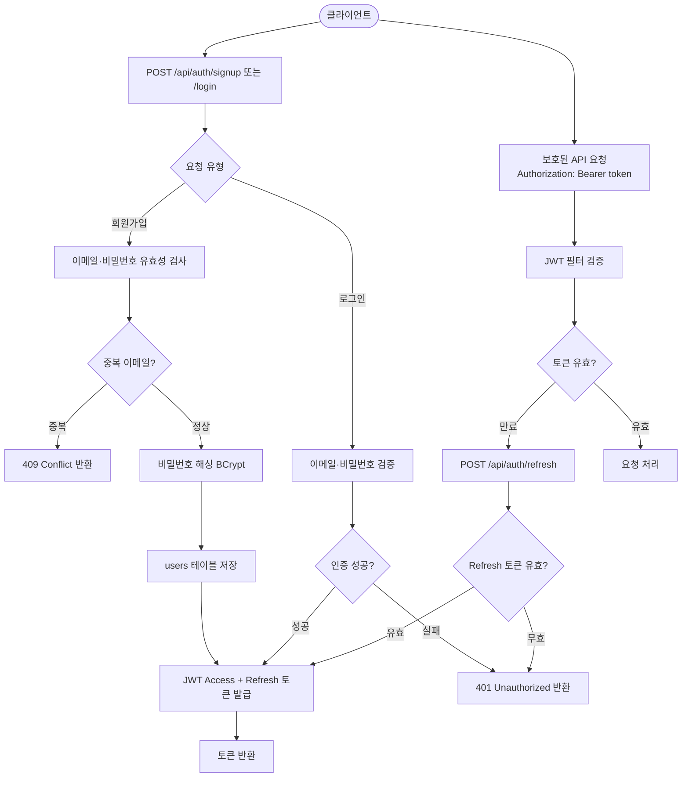
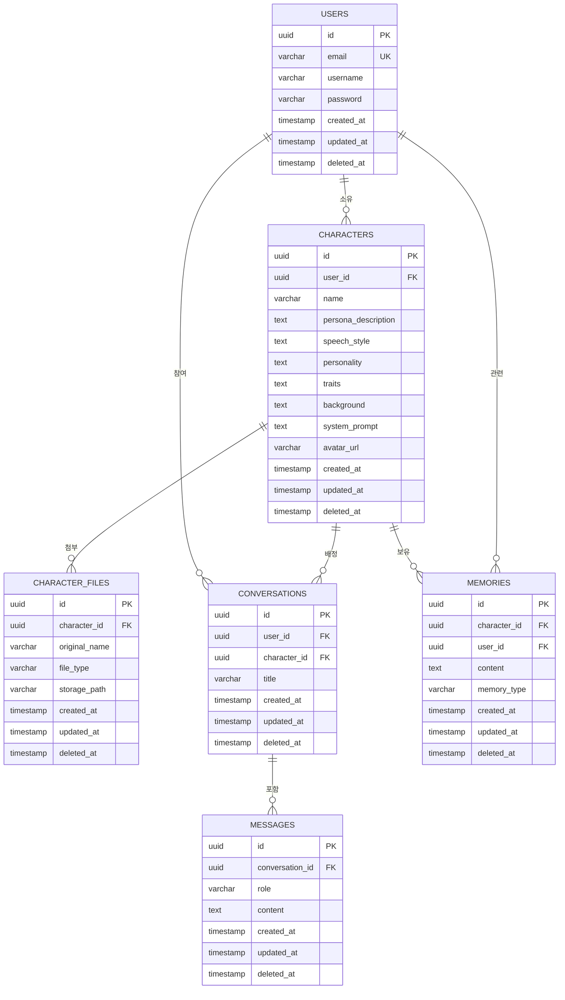

# YANARCHAT-BACKEND 시스템 아키텍처 문서

## 목차

1. [플로우차트](#플로우차트)
2. [테이블 명세서 및 ERD](#테이블-명세서-및-erd)
3. [API 명세서](#api-명세서)

---

## 플로우차트

### 전체 서비스 플로우



---

### 회원 인증 플로우



---

### 캐릭터 생성 플로우

```mermaid
flowchart TD
    A([사용자]) --> B[캐릭터 이름·설정·첨부파일 입력\nmultipart/form-data]
    B --> C[POST /api/characters]
    C --> D[입력값 유효성 검사]
    D --> E{첨부파일 존재?}
    E -- TXT/JSON 첨부 --> F[파일 저장 후 텍스트 파싱]
    F --> G[파싱 텍스트 + 설명 텍스트 병합]
    E -- 없음 --> G
    G --> H[LM Studio로 페르소나 속성 생성\n말투 · 성격 · 특징 · 배경 · 시스템 프롬프트]
    H --> I[characters 테이블 저장]
    I --> J{첨부파일 존재?}
    J -- 있음 --> K[character_files 테이블 저장]
    J -- 없음 --> L[Redis 캐시 저장\ncharacter:{id}]
    K --> L
    L --> M[201 Created + 캐릭터 정보 반환]
```

---

### 캐릭터 조회 Cache-Aside 플로우

```mermaid
flowchart TD
    A([클라이언트]) --> B[GET /api/characters/{id}]
    B --> C{Redis 캐시 존재?\ncharacter:{id}}
    C -- Cache Hit --> D[캐시 데이터 반환]
    C -- Cache Miss --> E[PostgreSQL 조회]
    E --> F{캐릭터 존재?\ndeleted_at IS NULL}
    F -- 없음 --> G[404 Not Found 반환]
    F -- 있음 --> H[Redis에 캐시 저장\nTTL: 1시간]
    H --> I[캐릭터 데이터 반환]

    J([캐릭터 수정/삭제]) --> K[DB 업데이트\nSoft Delete: deleted_at 설정]
    K --> L[Redis 캐시 무효화\nDEL character:{id}]
```

---

### 대화 및 메모리 플로우

```mermaid
flowchart TD
    A([사용자]) --> B[POST /api/conversations/{id}/messages]
    B --> C[messages 테이블에 사용자 메시지 저장]
    C --> D[Cache-Aside로 캐릭터 정보 조회]
    D --> E[해당 캐릭터의 장기 메모리 조회]
    E --> F[최근 N개 대화 이력 조회\n단기 컨텍스트]
    F --> G[프롬프트 구성\n시스템 프롬프트 + 말투·성격 + 메모리 + 대화 이력 + 현재 메시지]
    G --> H[LM Studio API 호출 Streaming]
    H --> I[SSE 스트리밍으로 클라이언트에 응답 전달]
    I --> J[완성된 응답을 messages 테이블에 저장]
    J --> K{메모리 추출 필요?}
    K -- 중요 정보 감지 --> L[memories 테이블에 장기 메모리 저장]
    K -- 일반 대화 --> M([완료])
    L --> M
```

---

## 테이블 명세서 및 ERD

### 공통 설계 정책

#### BaseEntity — 공통 Auditing 필드

모든 엔티티는 `BaseEntity`를 상속받으며 아래 컬럼을 공통으로 가진다.

| 컬럼명 | 타입 | 제약 | 설명 |
|---|---|---|---|
| created_at | TIMESTAMP | NOT NULL | 생성 시각 (JPA Auditing 자동 주입) |
| updated_at | TIMESTAMP | NOT NULL | 최종 수정 시각 (JPA Auditing 자동 주입) |
| deleted_at | TIMESTAMP | NULL | Soft Delete 시각. `NULL`이면 활성 레코드, 값이 있으면 삭제된 레코드 |

> **Soft Delete 정책:** 물리 삭제 대신 `deleted_at`에 현재 시각을 기록한다. 모든 조회 쿼리에는 `WHERE deleted_at IS NULL` 조건이 기본 적용된다. (`@SQLRestriction` 또는 `@Where` 어노테이션 활용)

#### PK 정책

모든 엔티티의 PK는 **UUID**를 사용한다. (`java.util.UUID`, DB 타입: `UUID`)

#### Redis 캐싱 정책 (Cache-Aside)

자주 조회되는 캐릭터 정보는 Redis를 통해 캐싱한다.

| 항목 | 내용 |
|---|---|
| 캐시 키 | `character:{characterId}` |
| TTL | 1시간 |
| 읽기 전략 | Cache-Aside: Redis Miss 시 DB 조회 후 캐시 적재 |
| 무효화 시점 | 캐릭터 수정(`PUT`) 또는 삭제(`DELETE`) 요청 시 해당 키 즉시 삭제 |

---

### ERD 다이어그램



---

### 테이블 명세서

> `created_at`, `updated_at`, `deleted_at`은 BaseEntity 상속 필드이므로 각 테이블 명세에서 생략한다.

---

#### `users` — 사용자

| 컬럼명 | 타입 | 제약 | 설명 |
|---|---|---|---|
| id | UUID | PK | 사용자 고유 식별자 |
| email | VARCHAR(255) | NOT NULL, UNIQUE | 로그인용 이메일 |
| username | VARCHAR(100) | NOT NULL | 사용자 표시 이름 |
| password | VARCHAR(255) | NOT NULL | BCrypt 해시 비밀번호 |

---

#### `characters` — AI 캐릭터 페르소나

| 컬럼명 | 타입 | 제약 | 설명 |
|---|---|---|---|
| id | UUID | PK | 캐릭터 고유 식별자 |
| user_id | UUID | FK → users.id, NOT NULL | 캐릭터 소유자 |
| name | VARCHAR(100) | NOT NULL | 캐릭터 이름 |
| persona_description | TEXT | NOT NULL | 사용자가 입력한 캐릭터 설정 원문 |
| speech_style | TEXT | NOT NULL | AI가 생성한 말투 설명 (예: "고어체, 격식체, 짧고 단호한 문장") |
| personality | TEXT | NOT NULL | AI가 생성한 성격 설명 (예: "냉정하지만 내면은 따뜻함") |
| traits | TEXT | NOT NULL | AI가 생성한 특징 목록 (JSON 배열 문자열로 저장) |
| background | TEXT | NOT NULL | AI가 생성한 캐릭터 배경·설정 |
| system_prompt | TEXT | NOT NULL | 위 속성들을 종합하여 생성한 최종 시스템 프롬프트 |
| avatar_url | VARCHAR(500) | NULL | 캐릭터 이미지 URL |

> **Redis 캐싱 대상:** `characters` 테이블의 단건 조회 결과가 `character:{id}` 키로 캐싱됨.

---

#### `character_files` — 캐릭터 생성용 첨부파일

| 컬럼명 | 타입 | 제약 | 설명 |
|---|---|---|---|
| id | UUID | PK | 파일 고유 식별자 |
| character_id | UUID | FK → characters.id, NOT NULL | 연결된 캐릭터 |
| original_name | VARCHAR(255) | NOT NULL | 업로드 시 원본 파일명 |
| file_type | VARCHAR(10) | NOT NULL | 파일 형식: `TXT` / `JSON` |
| storage_path | VARCHAR(500) | NOT NULL | 서버 내 파일 저장 경로 |

---

#### `conversations` — 대화 세션

| 컬럼명 | 타입 | 제약 | 설명 |
|---|---|---|---|
| id | UUID | PK | 대화 세션 고유 식별자 |
| user_id | UUID | FK → users.id, NOT NULL | 대화 참여 사용자 |
| character_id | UUID | FK → characters.id, NOT NULL | 대화 상대 캐릭터 |
| title | VARCHAR(200) | NULL | 대화 제목 (자동 생성 또는 사용자 지정) |

---

#### `messages` — 대화 메시지

| 컬럼명 | 타입 | 제약 | 설명 |
|---|---|---|---|
| id | UUID | PK | 메시지 고유 식별자 |
| conversation_id | UUID | FK → conversations.id, NOT NULL | 소속 대화 세션 |
| role | VARCHAR(20) | NOT NULL | 발화자 역할: `USER` / `ASSISTANT` |
| content | TEXT | NOT NULL | 메시지 내용 |

---

#### `memories` — 캐릭터 장기 메모리

| 컬럼명 | 타입 | 제약 | 설명 |
|---|---|---|---|
| id | UUID | PK | 메모리 고유 식별자 |
| character_id | UUID | FK → characters.id, NOT NULL | 메모리를 보유한 캐릭터 |
| user_id | UUID | FK → users.id, NOT NULL | 메모리가 관련된 사용자 |
| content | TEXT | NOT NULL | 저장된 기억 내용 |
| memory_type | VARCHAR(20) | NOT NULL | 메모리 유형: `SHORT_TERM` / `LONG_TERM` |

---

## API 명세서

> **Base URL:** `/api`
> **인증:** JWT Bearer Token (`Authorization: Bearer {token}`)
> **기본 Content-Type:** `application/json`

---

### 인증 (Auth)

#### `POST /api/auth/signup` — 회원가입

**Request Body**
```json
{
  "email": "user@example.com",
  "username": "홍길동",
  "password": "P@ssw0rd!"
}
```

**Response `201 Created`**
```json
{
  "accessToken": "eyJhbGci...",
  "refreshToken": "eyJhbGci..."
}
```

**Error**
| 상태코드 | 사유 |
|---|---|
| 400 | 입력값 유효성 오류 |
| 409 | 이미 사용 중인 이메일 |

---

#### `POST /api/auth/login` — 로그인

**Request Body**
```json
{
  "email": "user@example.com",
  "password": "P@ssw0rd!"
}
```

**Response `200 OK`**
```json
{
  "accessToken": "eyJhbGci...",
  "refreshToken": "eyJhbGci..."
}
```

**Error**
| 상태코드 | 사유 |
|---|---|
| 401 | 이메일 또는 비밀번호 불일치 |

---

#### `POST /api/auth/refresh` — 토큰 재발급

**Request Body**
```json
{
  "refreshToken": "eyJhbGci..."
}
```

**Response `200 OK`**
```json
{
  "accessToken": "eyJhbGci..."
}
```

**Error**
| 상태코드 | 사유 |
|---|---|
| 401 | Refresh 토큰 만료 또는 유효하지 않음 |

---

#### `POST /api/auth/logout` — 로그아웃

> 인증 필요

**Response `204 No Content`**

---

### 캐릭터 (Characters)

#### `POST /api/characters` — 캐릭터 생성

> 인증 필요
> **Content-Type:** `multipart/form-data`

**Request Form Fields**

| 필드명 | 타입 | 필수 | 설명 |
|---|---|---|---|
| name | String | Yes | 캐릭터 이름 |
| personaDescription | String | Yes | 캐릭터 설정 텍스트 |
| files | MultipartFile[] | No | TXT 또는 JSON 형식의 첨부파일 (복수 업로드 가능) |

**Request 예시 (multipart)**
```
--boundary
Content-Disposition: form-data; name="name"

아리아
--boundary
Content-Disposition: form-data; name="personaDescription"

중세 시대 왕국의 마법사. 냉정하지만 속으로는 따뜻한 성격...
--boundary
Content-Disposition: form-data; name="files"; filename="aria_detail.txt"
Content-Type: text/plain

[파일 내용: 상세 설정 텍스트]
--boundary--
```

**Response `201 Created`**
```json
{
  "id": "550e8400-e29b-41d4-a716-446655440000",
  "name": "아리아",
  "personaDescription": "중세 시대 왕국의 마법사...",
  "speechStyle": "고어체를 사용하며 격식 있고 짧은 문장으로 말한다. 감정을 잘 드러내지 않는다.",
  "personality": "냉정하고 이성적이나 가까운 이에게는 따뜻함을 보인다. 책임감이 강하다.",
  "traits": ["마법 전문가", "중세 왕국 출신", "검술도 능함", "비밀이 많음"],
  "background": "왕국의 수석 마법사로 오랜 시간 홀로 연구에 매진해왔다...",
  "systemPrompt": "You are Aria, a wizard of the medieval kingdom...",
  "avatarUrl": null,
  "files": [
    {
      "id": "661f9511-f30c-42e5-b827-557766551111",
      "originalName": "aria_detail.txt",
      "fileType": "TXT"
    }
  ],
  "createdAt": "2026-05-12T10:00:00Z"
}
```

**Error**
| 상태코드 | 사유 |
|---|---|
| 400 | 입력값 유효성 오류 또는 지원하지 않는 파일 형식 |
| 503 | LM Studio 연결 실패 (페르소나 생성 불가) |

---

#### `GET /api/characters` — 내 캐릭터 목록 조회

> 인증 필요

**Response `200 OK`**
```json
[
  {
    "id": "550e8400-e29b-41d4-a716-446655440000",
    "name": "아리아",
    "personality": "냉정하고 이성적이나 가까운 이에게는 따뜻함을 보인다.",
    "avatarUrl": null,
    "createdAt": "2026-05-12T10:00:00Z"
  }
]
```

---

#### `GET /api/characters/{characterId}` — 캐릭터 상세 조회

> 인증 필요
> **캐싱:** Cache-Aside 방식으로 Redis에서 우선 조회 (`character:{characterId}`, TTL 1시간)

**Response `200 OK`**
```json
{
  "id": "550e8400-e29b-41d4-a716-446655440000",
  "name": "아리아",
  "personaDescription": "중세 시대 왕국의 마법사...",
  "speechStyle": "고어체를 사용하며 격식 있고 짧은 문장으로 말한다.",
  "personality": "냉정하고 이성적이나 가까운 이에게는 따뜻함을 보인다.",
  "traits": ["마법 전문가", "중세 왕국 출신", "검술도 능함", "비밀이 많음"],
  "background": "왕국의 수석 마법사로 오랜 시간 홀로 연구에 매진해왔다...",
  "systemPrompt": "You are Aria, a wizard of the medieval kingdom...",
  "avatarUrl": null,
  "files": [
    {
      "id": "661f9511-f30c-42e5-b827-557766551111",
      "originalName": "aria_detail.txt",
      "fileType": "TXT"
    }
  ],
  "createdAt": "2026-05-12T10:00:00Z",
  "updatedAt": "2026-05-12T10:00:00Z"
}
```

**Error**
| 상태코드 | 사유 |
|---|---|
| 403 | 본인 소유 캐릭터 아님 |
| 404 | 캐릭터 없음 (또는 Soft Delete된 상태) |

---

#### `PUT /api/characters/{characterId}` — 캐릭터 수정

> 인증 필요
> **Content-Type:** `multipart/form-data`
> **캐싱:** 수정 완료 후 Redis 캐시 무효화 (`DEL character:{characterId}`)

**Request Form Fields**

| 필드명 | 타입 | 필수 | 설명 |
|---|---|---|---|
| name | String | No | 변경할 캐릭터 이름 |
| personaDescription | String | No | 변경할 설정 텍스트 |
| files | MultipartFile[] | No | 추가할 첨부파일 |

**Response `200 OK`** — 수정된 캐릭터 전체 정보 (상세 조회 응답과 동일)

---

#### `DELETE /api/characters/{characterId}` — 캐릭터 삭제

> 인증 필요
> **정책:** Soft Delete — `deleted_at`에 현재 시각 기록
> **캐싱:** 삭제 완료 후 Redis 캐시 무효화 (`DEL character:{characterId}`)

**Response `204 No Content`**

---

### 대화 세션 (Conversations)

#### `POST /api/conversations` — 대화 세션 생성

> 인증 필요

**Request Body**
```json
{
  "characterId": "550e8400-e29b-41d4-a716-446655440000",
  "title": "첫 번째 대화"
}
```

**Response `201 Created`**
```json
{
  "id": "772a1200-c41d-53f6-c938-668877662222",
  "characterId": "550e8400-e29b-41d4-a716-446655440000",
  "characterName": "아리아",
  "title": "첫 번째 대화",
  "createdAt": "2026-05-12T10:00:00Z"
}
```

---

#### `GET /api/conversations` — 내 대화 목록 조회

> 인증 필요

**Query Parameters**

| 파라미터 | 타입 | 필수 | 설명 |
|---|---|---|---|
| characterId | UUID | No | 특정 캐릭터의 대화만 필터링 |
| page | int | No | 페이지 번호 (기본값: 0) |
| size | int | No | 페이지 크기 (기본값: 20) |

**Response `200 OK`**
```json
{
  "content": [
    {
      "id": "772a1200-c41d-53f6-c938-668877662222",
      "characterId": "550e8400-e29b-41d4-a716-446655440000",
      "characterName": "아리아",
      "title": "첫 번째 대화",
      "updatedAt": "2026-05-12T11:00:00Z"
    }
  ],
  "totalElements": 1,
  "totalPages": 1
}
```

---

#### `GET /api/conversations/{conversationId}` — 대화 상세 조회 (메시지 포함)

> 인증 필요

**Query Parameters**

| 파라미터 | 타입 | 필수 | 설명 |
|---|---|---|---|
| page | int | No | 메시지 페이지 (기본값: 0) |
| size | int | No | 메시지 수 (기본값: 50) |

**Response `200 OK`**
```json
{
  "id": "772a1200-c41d-53f6-c938-668877662222",
  "characterId": "550e8400-e29b-41d4-a716-446655440000",
  "characterName": "아리아",
  "title": "첫 번째 대화",
  "messages": [
    {
      "id": "883b2311-d52e-64g7-d049-779988773333",
      "role": "USER",
      "content": "안녕하세요!",
      "createdAt": "2026-05-12T10:01:00Z"
    },
    {
      "id": "994c3422-e63f-75h8-e150-880099884444",
      "role": "ASSISTANT",
      "content": "어서오게나. 무슨 볼 일인가?",
      "createdAt": "2026-05-12T10:01:05Z"
    }
  ]
}
```

---

#### `DELETE /api/conversations/{conversationId}` — 대화 세션 삭제

> 인증 필요
> **정책:** Soft Delete — `deleted_at`에 현재 시각 기록

**Response `204 No Content`**

---

### 메시지 (Messages)

#### `POST /api/conversations/{conversationId}/messages` — 메시지 전송 (스트리밍)

> 인증 필요
> **응답 Content-Type:** `text/event-stream` (SSE)

**Request Body**
```json
{
  "content": "당신은 어떤 마법을 쓸 수 있나요?"
}
```

**Response `200 OK` — SSE Stream**
```
data: {"token": "저는"}
data: {"token": " 불꽃"}
data: {"token": " 마법과"}
data: {"token": " 바람"}
data: {"token": " 마법을"}
data: {"token": " 다룰"}
data: {"token": " 수"}
data: {"token": " 있다네."}
data: {"done": true, "messageId": "994c3422-e63f-75h8-e150-880099884444"}
```

**Error**
| 상태코드 | 사유 |
|---|---|
| 403 | 본인 소유 대화 아님 |
| 404 | 대화 세션 없음 (또는 Soft Delete된 상태) |
| 503 | LM Studio 연결 실패 |

---

### 메모리 (Memories)

#### `GET /api/characters/{characterId}/memories` — 캐릭터 메모리 목록 조회

> 인증 필요

**Query Parameters**

| 파라미터 | 타입 | 필수 | 설명 |
|---|---|---|---|
| type | String | No | `SHORT_TERM` / `LONG_TERM` |

**Response `200 OK`**
```json
[
  {
    "id": "aa5d4533-f74g-86i9-f261-991100995555",
    "content": "사용자는 마법에 관심이 많다.",
    "memoryType": "LONG_TERM",
    "createdAt": "2026-05-12T10:05:00Z"
  }
]
```

---

#### `DELETE /api/characters/{characterId}/memories/{memoryId}` — 메모리 삭제

> 인증 필요
> **정책:** Soft Delete — `deleted_at`에 현재 시각 기록

**Response `204 No Content`**

**Error**
| 상태코드 | 사유 |
|---|---|
| 403 | 본인 소유 메모리 아님 |
| 404 | 메모리 없음 |

---

### 공통 에러 응답 형식

```json
{
  "status": 400,
  "error": "Bad Request",
  "message": "입력값이 유효하지 않습니다.",
  "timestamp": "2026-05-12T10:00:00Z"
}
```
